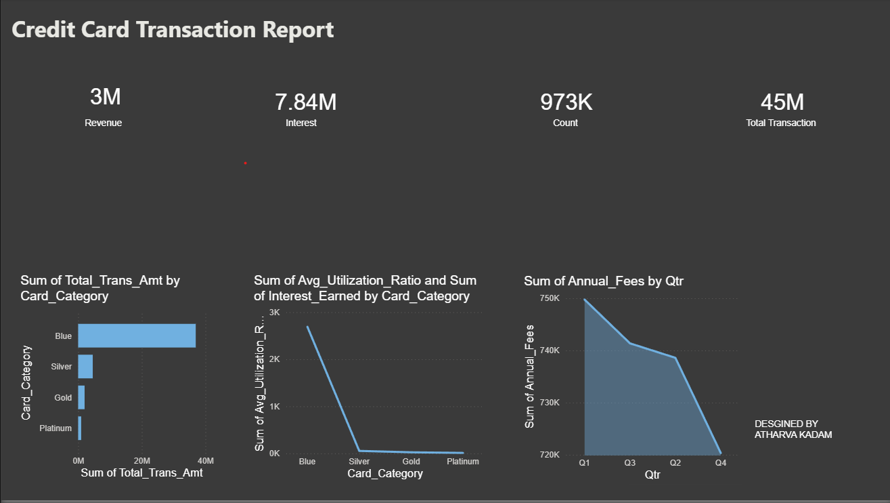

Credit Card Financial Dashboard
A Power BI report built to analyze credit card transaction data across revenue performance, customer acquisition costs, and card utilization patterns. The data was sourced from CSV files, cleaned through Power Query, loaded into a SQL database, and then modeled in Power BI with custom DAX measures.

Dashboard Preview

What the Numbers Show
A few things stood out once the data was fully loaded and the measures were in place:

Revenue: $3M in total transaction revenue across the dataset period.
Interest Earned: $7.84M — the interest line is actually a bigger number than the transaction revenue itself, which says a lot about where the real margin sits in credit products.
Transaction Volume: 45M+ individual transactions processed in total.
Card Category Breakdown: The Blue tier is by far the dominant revenue driver. Silver, Gold, and Platinum lag behind significantly — not just in raw revenue but in utilization rates. Premium cardholders are actually using their cards less, which is worth investigating from a product strategy standpoint.

Tech Stack

Power BI Desktop — data modeling, relationships, and all report visuals
Power Query — ETL on the raw CSV data before it hits the model
DAX — custom measures for revenue aggregation, interest calculations, and utilization ratios
SQL — initial data preparation and loading; scripts are in the /sql folder

Repository Structure
Credit-Card-Financial-Dashboard/
│
├── Credit_Card_Report.pbix    # The main Power BI report
│
├── data/
│   └── credit_card.csv        # Raw source data
│
├── sql/                       # SQL scripts for data prep and loading
│
└── assets/                    # Screenshots used in this README

Getting Started
1. Clone the repo
bashgit clone https://github.com/atharvakadam-7/Credit-Card-Financial-Dashboard.git
2. Open the report
Open Credit_Card_Report.pbix in Power BI Desktop. The latest version is free from Microsoft's site.
3. Fix data paths if needed
Power BI stores absolute file paths internally, so if the data doesn't load automatically on your machine:

Go to Transform Data → Data Source Settings
Update the path to point to data/credit_card.csv in the cloned folder

This is a one-time step after cloning and doesn't affect the report structure or any of the measures.
4. SQL scripts (optional)
If you want to replicate the data preparation step or load the data into a local database before connecting Power BI, the scripts in /sql handle the table creation and data loading. They're written to work with the CSV included in this repo.
